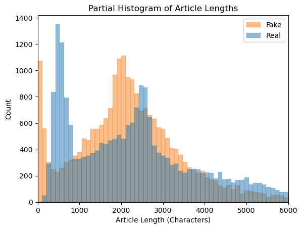
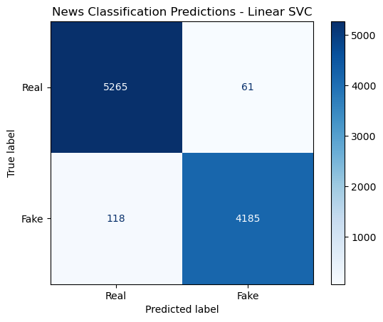

# Fake News Classifier


## Summary
I was tasked with creating a model to predict when an article is "real news" or "fake news." This model can be used by social media platforms such as Twitter to either quickly analyze and automatically label potentially misleading content for users, or expedite the process of detecting potentially misleading information for their moderators to review.

I used the ISOT Fake News dataset by Hadeer Ahmed, Issa Traore, and Sherif Saad and disseminated through the Information Security and Object Technology (ISOT) Research Group at the University of Victoria to train my model. The dataset includes 21417 real news articles and 23481 fake news articles from 2016 and 2017, and covers a variety of topics including US and world politics and news, along with other current affairs topics.

When building my models, I prioritized maximizing accuracy - the overall proportion of correct predictions by the model. There are costs associated with an incorrect prediction in either direction (either giving a stamp of authenticity to an unreliable article, or unfairly labeling a reliable article as "fake news") so I wanted my model to make as few incorrect predictions overall as possible.

My preprocessing included removing stop words, URLs, Twitter handles, numbers, punctuation, and other non-semantic information. I tokenized and lemmatized the remaining words, and vectorized them using a TF-IDF vectorizer. I then tested a variety of different classification models, eventually settling on an untuned Linear SVC model. The model achieved roughly a 98.1% accuracy score on unseen data.

## Business Problem

"Fake news" has been a hot topic since the 2016 election, but the issue of whether information is reliable is much older. Readers deserve to know whether a given article they encounter on social media is reliable or not before they share it with their network.

As a rapid-reaction platform, Twitter has a particular interest in being up front with its users about whether content they are encountering is reliable or not. Even Elon Musk recently reshared an [unreliable article about a prominent political figure](https://www.axios.com/2022/10/30/elon-musk-paul-pelosi-tweet-rumor), underlining the platform's problem with misinformation. That problem has impacts on the bottom line - spending by Twitter's previous top advertisers has [dropped dramatically in recent months due to their concerns about the safety and stability of the platform](https://www.cnn.com/2023/02/10/tech/twitter-top-advertiser-decline/index.html). Twitter must take steps to reassure advertisers, and its broader user base, that it can be trusted to avoid further reputational and financial damage.

By building a model to detect and label unreliable content, Twitter can begin to restore that trust and earn back the revenue they have lost.

## Data Understanding

I used [the ISOT Fake News dataset by Hadeer Ahmed, Issa Traore, and Sherif Saad and disseminated through the Information Security and Object Technology (ISOT) Research Group at the University of Victoria](https://onlineacademiccommunity.uvic.ca/isot/2022/11/27/fake-news-detection-datasets/) to train my model. The dataset includes 21417 real news articles and 23481 fake news articles from 2016 and 2017, and covers a variety of topics including US and world politics and news, along with other current affairs topics. [According to the creators of the dataset](https://onlineacademiccommunity.uvic.ca/isot/wp-content/uploads/sites/7295/2023/02/ISOT_Fake_News_Dataset_ReadMe.pdf): "This dataset was collected from realworld sources; the truthful articles were obtained by crawling articles from Reuters.com (News website). As for the fake news articles, they were collected from different sources. The fake news
articles were collected from unreliable websites that were flagged by Politifact (a fact-checking
organization in the USA) and Wikipedia."

## EDA, Cleaning, Modeling, and Evaluation
EDA revealed that there were some duplicate articles which I removed. It further revealed that several hundred of the articles in the dataset had no or very few characters, and were essentially just landing pages for videos or graphics. All of these articles were labeled as fake news. I removed these articles, and determined that a different approach would be needed to effectively flag any misleading content on those pages.



After this initial EDA and cleaning, I began processing my data. Before building my final models, I undertook the following processing steps:
    1. Changing all strings to lowercase.
    2. Dropping URLs, Twitter names, numbers, punctuation, the word 'Reuters' (to avoid data leakage, since it was extensively associated with real news in the data), and other non-semantic information.
    3. Tokenizing all strings of three characters or longer.
    4. Removing stopwords.
    5. Lemmatizing all remaining tokens.
    6. Vectorizing the resulting lemmas using a TF-IDF vectorizer.
    
After processing my data, I tried four different models: a naive Bayes, a logistic regression, a Linear Support Vector Classifier (SVC), and a random forest. The Linear Support Vector Classifier performed the best of any model, and was not improved by further hyperparameter tuning. This model achieved an accuracy of 98.1% on unseen data.



Once I selected my final model, I generated predictions for every article in the dataset and compared the word clouds of the most commonly occurring words for true positives (correctly predicted fake news), true negatives (correctly predicted real news), false positives (news the model predicted was fake, but was actually real), and false negatives (the opposite). I also compared which words were most commonly assigned the highest TF-IDF weight for their document.

## Streamlit App
I build a simple Streamlit app that allows a user to paste the contents of an article into a text area and generate a prediction about whether the article is real or fake news based on its contents. The app works fine on data it was trained on (mostly about US politics and world news), but is largely unreliable due to the very narrow scope of its training data. It would be more useful with a larger training set - but for now, it's fun to experiment.

## Conclusions and Next Steps

Overall, the model was very successful at detecting which articles from this dataset are real vs. fake news. In order to be more broadly applicable, the model would have to be scaled by dramatically increasing the size and scope of the training data - preferably by feeding it thousands or even millions more articles from an ideologically diverse set of reliable and unreliable sources over a long period of time. As a proof of concept however, this is a promising start.

Some next steps I would like to take are:
1. Massively increase the size of the training data, with articles from a wide array of organizations. Partner with impartial fact-checking organizations to ensure validity of labels in training data.
2. The EDA on article length revealed a gap in fake news detection in the form of video content. I'd like to work with transcription services to quickly analyze and label misleading video content.
3. Continue to refine preprocessing and modeling to further shrink number of incorrect predictions.
4. Test the model on article headlines to see how it performs.

## Links to Materials
[Presentation](Fake_News_Classifier_Slides.pdf)  
[Jupyter Notebook](Fake_News_Classifier_Modeling.ipynb)

## Repository Structure
```
├── images
├── data
├── .gitignore
├── Streamlit_App.py
├── best_svc_model.pkl
├── tfidf_lemm.pkl
├── Fake_News_Classifier_Slides.pdf
├── Fake_News_Classifier_Modeling.ipynb
└── README.md
```
